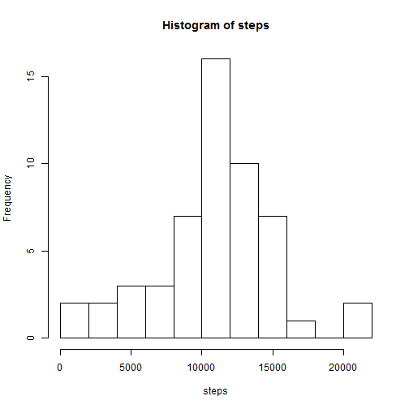
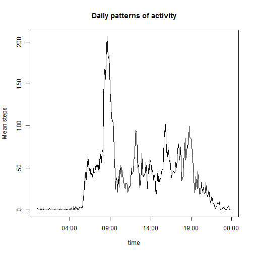
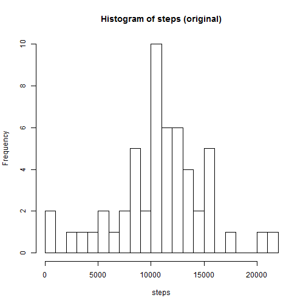
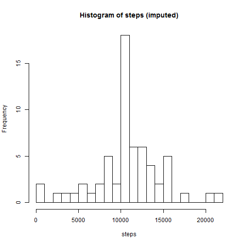
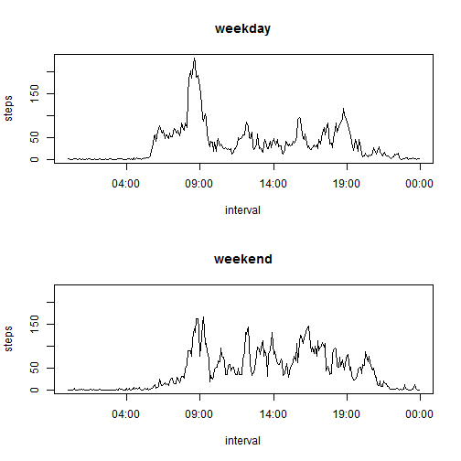

# Reproducible Research: Peer Assessment 1

## Tools
Here I include constants and routines that are used in the rest of the document.

#### Constants

```r
DATA_FILE = "..\\..\\Data\\activity.csv"
LIST_OF_WEEKDAYS = c("Monday","Tuesday","Wednesday","Thursday","Friday")
```

#### Support functions

```r
# Converts a date (in text) and time of numeric format to POSIXct format
#   Input: dt_text is the date (text format, yyyy-mm-dd)
#   Input: tm_number is the time (integer of form hM, e.g. 105 is 1:05)
#   Output: Time/Date stamp, combining the two pieces of information
convert_date_time = function(dt_text,tm_number) {
    tm_text = sprintf("%04d",tm_number)
    date_time_text = paste(dt_text, tm_text)
    result = as.POSIXct(date_time_text,format = "%Y-%m-%d %H%M", tz="GMT")
    return(result) #I prefer explicit, simple returns - not efficient but...
}

# Specialized plot to compare weekends and weekdays
plot_steps_vs_time = function(dta,day_type,max_steps){
    m = dta[dta$weekday_factor == day_type,]
    with(m, plot(time,
                 steps,
                 type="l",
                 xlab = "interval",
                 ylim=c(0,max_steps),
                 main=day_type
                 )
         )
}

#Test; should return 2012-12-14 01:20:00 GMT
convert_date_time("2012-12-14",120)
```

```
## [1] "2012-12-14 01:20:00 GMT"
```

## Loading and preprocessing the data

#### Load

```r
dta = read.csv(DATA_FILE)
```
#### Process (Add *date_time* and *time* columns to *dta*)

```r
dta$date_time = mapply(convert_date_time,
                       dta$date,
                       dta$interval,
                       SIMPLIFY=FALSE
                       )
dta$time = unlist(mapply(function(a){unlist(format(a,"%H:%M"))}, 
                         dta$date_time, 
                         SIMPLIFY=FALSE
                         )
                  )
dta$time = as.POSIXct(dta$time, format="%H:%M")
```
## What is mean total number of steps taken per day?

```r
total_steps = aggregate(steps ~ date, dta, sum)
with(total_steps,hist(steps, breaks=10))
```

 

```r
mean_steps = mean(total_steps$steps, na.rm = TRUE)    #Variable used below
median_steps = median(total_steps$steps,na.rm = TRUE) #Variable used below
```

The total number of steps per day has a **median of 10765** and **mean of 1.0766 &times; 10<sup>4</sup>**

## What is the average daily activity pattern?

```r
means_per_interval = aggregate(steps ~ time, dta, mean)
with(means_per_interval, 
     plot(x = time,
          y = steps,
          type = "l",
          ylab = "Mean steps",
          main = "Daily patterns of activity"
          )
     )
```

 

```r
max_mean = max(means_per_interval$steps) # Variable reported below
max_ind = which(means_per_interval$steps == max_mean)
max_interval = means_per_interval$time[max_ind]
max_interval = format(max_interval,"%H:%M") # Variable reported below
```

The maximum mean number of steps found in any interval (206.1698)
is found in the interval starting at **08:35**.

## Imputing missing values

#### Report number of missing values

```r
count_of_missing_values = sum(is.na(dta$steps)) # Variable reported below
```

The total number of missing values is **2304**.

#### Strategy for filling in missing values
The goal for filling missing values is to minimize the effect of new values on the overall structure.  The simplest method that has some chance of doing this is one that uses the mean activity at a particular time of day to replace values that are missing at that time of day (i.e. we assume that variation caused by time of day is greater than variation driven by the date).

#### Use strategy and create new dataset

```r
na_idx = is.na(dta$steps)
na_time_list = dta$time[na_idx]
matches = match(na_time_list,means_per_interval$time)
dta_imputed = dta
dta_imputed$steps[na_idx] = means_per_interval$steps[matches]
```

The new dataset, *dta_imputed*, has been created.

#### How does imputation affect the results?

```r
# Count steps per day
steps_per_day     = aggregate(steps ~ date, dta,         sum)
steps_per_day_imp = aggregate(steps ~ date, dta_imputed, sum)

# Histograms
with(steps_per_day,hist(steps,breaks=20,main="Histogram of steps (original)"))
```

 

```r
with(steps_per_day_imp,hist(steps,breaks=20,main="Histogram of steps (imputed)"))
```

 

```r
#Table comparing results
means   = c(Original = mean(      steps_per_day$steps), 
            Imputed  = mean(  steps_per_day_imp$steps))
medians = c(Original = median(    steps_per_day$steps), 
            Imputed  = median(steps_per_day_imp$steps))
means = as.data.frame(means)
medians = as.data.frame(medians)
tbl = cbind(means,medians)
tbl
```

```
##          means medians
## Original 10766   10765
## Imputed  10766   10766
```

This form of imputation has minimal effect on the "center" because missing values are in entire days -- effectively in imputation increases the number of "average" days. Side effects for the choice of imputation method on the total number of steps in a day include:

- The mean remains unchanged.
- Days filled with NA are replaced with "average" days (increasing the number of such days)
- The median is driven closer to the mean.
- The variance (not displayed) is reduced.
- The shape of the histogram is changed except for the rectangle containing the mean, which increases in size.

The size of these effects are dependent on the number of missing values. This analysis also assumes that entire days are missing, not partial days.

## Are there differences in activity patterns between weekdays and weekends?

#### Create new factor (*weekday_or_end*)


```r
# I'm annoyed with the [[1]] hack but I haven't found a way around it yet.
# It has to do with the use of mapply above.
weekday_list = unlist(lapply(X = dta_imputed$date_time,
                             FUN = function(a){weekdays(a[[1]])}
                             )
                      )
weekday_label = unlist(lapply(X = weekday_list,
                             FUN = function(a)
                                 {
                                 if(a %in% LIST_OF_WEEKDAYS){"weekday"}
                                 else {"weekend"}
                                 }
                             )
                      )
weekday_factor = as.factor(weekday_label)

# I decided on new variables to simplify testing
dta_w_weekday         = cbind(dta,        weekday_factor)
dta_w_weekday_imputed = cbind(dta_imputed,weekday_factor)
```

#### Panal plot - compare weekdays and weekends


```r
# Aggregate on new factor
# (Using m as a temporary variable to simplify the appearance)
m = aggregate(steps ~ time + weekday_factor,
              dta_w_weekday_imputed,
              mean
              )
# Find max steps to put two plots on same scale
max_steps = max(m$steps)

# Plot
par(mfrow = c(2,1))
plot_steps_vs_time(m,"weekday",max_steps)
plot_steps_vs_time(m,"weekend",max_steps)
```

 
